# Design Document — tiktok-youtube-stability-fix

## Overview

Feature ini adalah perbaikan komprehensif stabilitas platform TikTok dan YouTube Shorts pada aplikasi **Social Media AI** (viral-ig-scraper). Sebelumnya aplikasi hanya berjalan stabil untuk Instagram; TikTok dan YouTube Shorts mengalami berbagai kegagalan intermiten.

Perbaikan dikelompokkan menjadi empat grup utama:

- **Grup A — Stabilitas Analisis**: Retry dengan `withBackoff`, penanganan safety block Gemini, dan fallback analysis yang informatif.
- **Grup B — Konsistensi Import URL**: Deteksi URL TikTok mobile (`vm.tiktok.com`), normalisasi URL YouTube `watch?v=`, dan rate limiting pada import paralel.
- **Grup C — Creator & View Videos Fix**: Perbaikan `scrapeCreatorStats` TikTok/YouTube, pemetaan platform di repository, dan normalisasi nama creator.
- **Grup D — Legacy Cleanup**: Audit dan penghapusan `pipeline.ts` yang masih mengimpor dari modul CSV lama.

Tidak ada tabel database baru atau API endpoint baru yang dibuat — semua perubahan adalah modifikasi pada file yang sudah ada.

---

## Architecture

### Gambaran Alur Sistem

```mermaid
graph TD
    subgraph "Import Flow"
        A[User paste URL] --> B[Import Route]
        B --> C{Platform Detector}
        C -->|TikTok vm/vt/www| D[normalisedUrl TikTok]
        C -->|YouTube watch?v=| E[normalisedUrl /shorts/VIDEO_ID]
        C -->|Unknown| F[skipped + reason]
        D --> G[p-limit 3 + 500ms delay]
        E --> G
        G --> H[Ytdlp Wrapper + withBackoff]
        H --> I[repo.videos.upsertScraped]
    end

    subgraph "Analysis Flow"
        J[POST /api/videos/id/analysis] --> K[withBackoff wrapper]
        K --> L{Download Video}
        L -->|provider| M[Provider Download]
        L -->|refresh| N[URL Refresh]
        L -->|ytdlp| O[yt-dlp Direct]
        L -->|all fail| P[Text-only Analysis]
        M --> Q[Gemini Upload + Analyze]
        N --> Q
        O --> Q
        Q --> R{Gemini Response}
        R -->|empty = safety block| S[outcome: fallback]
        R -->|invalid JSON| T[throw - retriable]
        R -->|valid JSON| U[outcome: ok]
        P --> V[analyzeWithProvider allowFallback:true]
    end

    subgraph "Creator Stats Flow"
        W[Add Creator TikTok] --> X[scrapeCreatorStats]
        X --> Y[listChannelVideosWithProfile hydrate:false]
        Y --> Z[flat-playlist data]
        Z --> AA[filter view_count > 0]
        AA --> AB[avgViews30d]
        X -->|VALIDATION_ERROR| AC[return empty stats + warning]
    end
```



### Komponen yang Dimodifikasi

| File | Grup | Perubahan Utama |
|------|------|-----------------|
| `api/videos/[id]/analysis/route.ts` | A | `withBackoff` wrapping, `allowFallback: true` |
| `lib/gemini-json-analysis.ts` | A | Safety block → fallback, JSON error → throw |
| `lib/quality.ts` | A | `makeFallbackAnalysis` — filter metadata string, fix hook |
| `lib/platform-detect.ts` | B | `TIKTOK_RE` perluas vm/vt, YouTube watch → /shorts/ |
| `api/import/instagram-urls/route.ts` | B | `Promise.all` → `p-limit(3)` + 500ms delay |
| `lib/providers/ytdlp.ts` | B | `withBackoff` pada `execFileAsync`, skip non-retriable |
| `lib/providers/tiktok-provider.ts` | C | `hydrate: false`, filter view_count > 0 |
| `lib/providers/youtube-provider.ts` | C | filter view_count > 0, log warning fallback |
| `db/repositories.ts` | C | `rowToCreator` — terima semua platform valid |
| `app/videos/page.tsx` | C | `norm()` — tambah penghapusan `-` |
| `lib/pipeline.ts` | D | Hapus atau tambah deprecation notice |

---

## Components and Interfaces

### Grup A — Stabilitas Analisis

#### `withBackoff` di Analysis Route

`withBackoff` sudah ada di `lib/retry.ts` dengan signature:

```typescript
async function withBackoff<T>(
  fn: () => Promise<T>,
  options?: { retries?: number; baseMs?: number; maxMs?: number; shouldRetry?: (err: unknown) => boolean }
): Promise<T>
```

Di `analysis/route.ts`, seluruh blok Gemini upload + analyze dibungkus dengan `withBackoff`:

```typescript
// Sebelum
const file = await uploadVideo(downloaded.buffer, downloaded.contentType);
const structured = await analyzeVideoToStructuredJson({ ... });

// Sesudah
const structured = await withBackoff(async () => {
  const file = await uploadVideo(downloaded.buffer, downloaded.contentType);
  return analyzeVideoToStructuredJson({ ... });
}, { retries: 3 });
```

#### Safety Block Handling di `gemini-json-analysis.ts`

Kondisi saat ini sudah mengembalikan `{ outcome: "fallback" }` untuk respons kosong. Perubahan yang diperlukan adalah memastikan `makeFallbackAnalysis` dipanggil dengan parameter yang benar (transcript dan summary yang valid, bukan string metadata mentah).

#### `makeFallbackAnalysis` di `quality.ts`

Perubahan pada fungsi `makeFallbackAnalysis`:

```typescript
// Deteksi string metadata mentah: "@username, N views, N likes, caption: ..."
const METADATA_PATTERN = /^@\w+,\s*\d+\s*views/i;

export function makeFallbackAnalysis(transcript = "", summary = ""): VideoAnalysis {
  // Abaikan summary jika berisi string metadata mentah
  const cleanSummary = METADATA_PATTERN.test(summary)
    ? "Analisis dihasilkan dari metadata yang tersedia."
    : summary || "Analisis dihasilkan dari metadata yang tersedia.";

  // Hook: kalimat pertama transcript atau fallback
  const firstSentence = transcript.split(/[.!?]/)[0]?.trim().slice(0, 160);
  const hook = firstSentence || "Hook tidak tersedia";

  return {
    hook,
    summary: cleanSummary,
    transcript,
    // ... field lainnya
  };
}
```

### Grup B — Konsistensi Import URL

#### Perluasan `TIKTOK_RE` di `platform-detect.ts`

Regex saat ini sudah mencakup `vm.` dan `vt.` dalam pattern:

```typescript
const TIKTOK_RE = /^(?:https?:\/\/)?(?:www\.|vm\.|vt\.|m\.)?tiktok\.com\/(?:@([^/]+)\/video\/(\d+)|v\/(\d+)|t\/([^/?#]+)|([A-Za-z0-9]{6,}))/i;
```

Namun URL `vm.tiktok.com/XXXXX` (tanpa path `/t/`) perlu ditangkap oleh capture group terakhir `([A-Za-z0-9]{6,})`. Perlu diverifikasi bahwa shortcode ter-extract dengan benar untuk semua format.

#### Normalisasi URL YouTube `watch?v=`

Sudah ada di kode saat ini — `YOUTUBE_WATCH_RE` mengembalikan `normalisedUrl: https://www.youtube.com/shorts/${yw[1]}`. Yang perlu dipastikan adalah `Import_Route` menggunakan `detected.normalisedUrl` (bukan `item.url` raw) saat memanggil `getVideoMetadata`.

#### Rate Limiting dengan `p-limit` di Import Route

```typescript
import pLimit from "p-limit";

// Ganti Promise.all dengan p-limit(3) + delay antar batch
const limit = pLimit(3);
let batchCount = 0;

const imported = await Promise.all(
  parsed.data.urls.map((item, index) =>
    limit(async () => {
      // Delay 500ms setiap 3 URL (antar batch)
      if (index > 0 && index % 3 === 0) {
        await new Promise((r) => setTimeout(r, 500));
      }
      // ... proses URL
    })
  )
);
```

#### `withBackoff` di `ytdlp.ts`

Wrap `execFileAsync` calls dengan `withBackoff` dan skip retry untuk error non-retriable:

```typescript
const isNonRetriable = (err: unknown) => {
  const msg = err instanceof Error ? err.message : String(err);
  return /secondary user ID|tiktokuser/i.test(msg);
};

const result = await withBackoff(
  () => execFileAsync(cmd, args, { maxBuffer, timeout }),
  {
    retries: 4,
    shouldRetry: (err) => {
      if (isNonRetriable(err)) return false;
      const msg = err instanceof Error ? err.message : String(err);
      return /429|503|502|504|ECONNRESET|timed? ?out|ETIMEDOUT/i.test(msg);
    },
  }
);
```

### Grup C — Creator & View Videos Fix

#### `hydrate: false` di `tiktok-provider.ts`

Perubahan dari `hydrate: true` ke `hydrate: false` pada `scrapeCreatorStats`:

```typescript
// Sebelum
listing = await listChannelVideosWithProfile(tiktokProfileUrl(username), 12, true);

// Sesudah
listing = await listChannelVideosWithProfile(tiktokProfileUrl(username), 12, false);
```

Dengan `hydrate: false`, `view_count` diambil dari flat-playlist data. Perlu filter video dengan `view_count > 0`:

```typescript
const validItems = listing.items.filter((r) => (r.viewCount ?? 0) > 0);
const avgViews30d = validItems.length
  ? Math.round(validItems.reduce((sum, r) => sum + (r.viewCount ?? 0), 0) / validItems.length)
  : 0;
```

#### Filter `view_count > 0` di `youtube-provider.ts`

Sama seperti TikTok, filter video dengan `view_count > 0` saat menghitung `avgViews30d`.

#### `rowToCreator` di `repositories.ts`

Perbaikan pemetaan platform:

```typescript
function rowToCreator(row: { ... }): Creator {
  // Terima semua nilai valid, fallback ke "instagram" untuk nilai tidak dikenal
  const validPlatforms = ["tiktok", "youtube_shorts", "instagram"] as const;
  const platform = validPlatforms.includes(row.platform as typeof validPlatforms[number])
    ? (row.platform as Creator["platform"])
    : "instagram";
  // ...
}
```

Kode saat ini sudah melakukan ini dengan benar:
```typescript
const platform = (row.platform === "tiktok" || row.platform === "youtube_shorts"
  ? row.platform
  : "instagram") as Creator["platform"];
```

Namun perlu dipastikan bahwa nilai `"instagram"` eksplisit juga diterima (tidak hanya sebagai fallback).

#### Fungsi `norm` di `videos/page.tsx`

```typescript
// Sebelum
const norm = (u: string) => u.toLowerCase().replace(/^@/, "").replace(/[._]/g, "");

// Sesudah — tambah penghapusan karakter -
const norm = (u: string) => u.toLowerCase().replace(/^@/, "").replace(/[._-]/g, "");
```

Kode saat ini sudah mengandung `[._-]` dalam regex. Perlu diverifikasi bahwa idempotence terpenuhi: `norm(norm(x)) === norm(x)`.

### Grup D — Legacy Cleanup

#### Audit `pipeline.ts`

`pipeline.ts` mengimpor dari `./csv` (modul legacy) dan tidak digunakan oleh code path aktif. Perlu diaudit dengan `grep` untuk memastikan tidak ada import aktif, kemudian dihapus atau diberi deprecation notice.

---

## Data Models

Tidak ada perubahan skema database. Semua perubahan adalah pada logika aplikasi.

### Tipe Data yang Relevan

```typescript
// Dari lib/types.ts
type SocialPlatform = "instagram" | "tiktok" | "youtube_shorts";

interface Creator {
  id: string;
  platform: SocialPlatform;
  username: string;
  aliases?: string[];
  // ...
}

// Dari lib/quality.ts
interface VideoAnalysis {
  hook: string;
  summary: string;
  transcript: string;
  // ...
}

// Dari lib/gemini-json-analysis.ts
type AnalysisOutcome = "ok" | "fallback" | "failed";
```

### Invariant Data

- `Creator.platform` selalu salah satu dari `"instagram" | "tiktok" | "youtube_shorts"`.
- `VideoAnalysis` selalu valid menurut `VideoAnalysisSchema` (Zod schema).
- `normalisedUrl` untuk YouTube `watch?v=VIDEO_ID` selalu dalam format `https://www.youtube.com/shorts/VIDEO_ID`.
- `norm(norm(x)) === norm(x)` untuk semua nama creator.

---

## Keputusan Desain

### Mengapa `hydrate: false` untuk `scrapeCreatorStats` TikTok

Dengan `hydrate: true`, `listChannelVideosWithProfile` memanggil `getVideoMetadata` untuk setiap video secara berurutan. Untuk 12 video, ini berarti 12 panggilan yt-dlp terpisah, masing-masing dengan timeout 90 detik — total bisa mencapai 18 menit dalam kasus terburuk.

Dengan `hydrate: false`, hanya satu panggilan `--flat-playlist` yang dilakukan. Data `view_count` dari flat-playlist memang kurang akurat (kadang 0 untuk video baru), tetapi cukup untuk menghitung `avgViews30d` yang representatif. Video dengan `view_count = 0` difilter sebelum kalkulasi.

**Trade-off**: Akurasi `avgViews30d` sedikit berkurang untuk video yang baru diupload (belum ada view count di flat-playlist), tetapi kecepatan Add Creator meningkat drastis dari potensial timeout menjadi di bawah 30 detik.

### Mengapa Sequential + `p-limit(3)` untuk Import URL

`Promise.all` memproses semua URL secara paralel tanpa batas. Untuk 10+ URL TikTok/YouTube, ini menghasilkan 10+ panggilan yt-dlp secara bersamaan, yang menyebabkan:
1. Rate limiting dari TikTok/YouTube (HTTP 429)
2. Timeout karena terlalu banyak proses yt-dlp berjalan bersamaan
3. Kegagalan semua URL sekaligus

`p-limit(3)` membatasi concurrency ke 3 URL paralel, dan delay 500ms antar batch memberikan jeda yang cukup untuk menghindari rate limiting. Ini adalah trade-off antara kecepatan dan keandalan — import 10 URL membutuhkan ~2 detik lebih lama, tetapi tingkat keberhasilan jauh lebih tinggi.

### Bagaimana `withBackoff` di `ytdlp.ts` Berinteraksi dengan Retry yang Sudah Ada

Saat ini `getVideoMetadata` dan `listChannelVideosWithProfile` sudah memiliki retry manual (loop `for attempt < 2`). Dengan menambahkan `withBackoff`, ada dua lapisan retry:

1. **Inner retry** (loop manual): Menangani timeout/ECONNRESET dengan 1 retry langsung.
2. **Outer retry** (`withBackoff`): Menangani 429, 503, dan error transient lainnya dengan exponential backoff hingga 4 retry.

Untuk menghindari duplikasi, loop manual di dalam `getVideoMetadata` dan `listChannelVideosWithProfile` akan dihapus dan digantikan sepenuhnya oleh `withBackoff`. Ini menyederhanakan kode dan memberikan retry yang lebih konsisten.

### Strategi Normalisasi Nama Creator yang Idempotent

Fungsi `norm` menghapus karakter `@`, `.`, `_`, `-` dan mengubah ke lowercase. Idempotence terpenuhi karena:
- `toLowerCase()` idempotent: `"abc".toLowerCase() === "abc"`
- `replace(/^@/, "")` idempotent: setelah `@` dihapus, tidak ada `@` di awal lagi
- `replace(/[._-]/g, "")` idempotent: setelah karakter dihapus, tidak ada lagi yang perlu dihapus

Bukti formal: `norm(norm(x)) = norm(x)` karena setiap operasi dalam `norm` adalah idempotent dan tidak menghasilkan karakter yang akan dihapus oleh operasi lain.

---

## Error Handling

### Hierarki Error

```
ProviderError (code: "VALIDATION_ERROR")
  └── TikTok handle tidak bisa di-resolve → return empty stats (bukan throw)

ProviderError (code: "PROVIDER_AUTH")
  └── yt-dlp tidak tersedia → throw (user harus install yt-dlp)

Error (retriable)
  └── HTTP 429, timeout, ECONNRESET → withBackoff retry

Error (non-retriable)
  └── "secondary user ID", "tiktokuser" → throw langsung tanpa retry
```

### Matriks Error per Komponen

| Komponen | Error | Penanganan |
|----------|-------|------------|
| `gemini-json-analysis.ts` | Respons kosong (safety block) | Return `{ outcome: "fallback" }` |
| `gemini-json-analysis.ts` | JSON parse error | Throw (retriable oleh caller) |
| `analysis/route.ts` | Semua retry habis | HTTP 500 + `analysisStatus: "failed"` |
| `analysis/route.ts` | Download gagal semua | Lanjut ke text-only analysis |
| `ytdlp.ts` | HTTP 429 / timeout | `withBackoff` retry (maks 4x) |
| `ytdlp.ts` | "secondary user ID" | Throw `ProviderError("VALIDATION_ERROR")` langsung |
| `tiktok-provider.ts` | `VALIDATION_ERROR` | Return `{ followers: 0, reelsCount30d: 0, avgViews30d: 0 }` |
| `youtube-provider.ts` | `/shorts` gagal | Fallback ke `/videos` + log warning |
| `import/route.ts` | URL tidak dikenali | Masuk ke `skipped[]` dengan alasan spesifik |

### Pesan Error yang Informatif

Setiap error yang dikembalikan ke user harus mengandung:
1. **Platform** yang terlibat (TikTok, YouTube Shorts, dll.)
2. **Metode yang sudah dicoba** (provider download, URL refresh, yt-dlp direct)
3. **Saran tindakan** (misal: "Coba import ulang URL video")

Contoh pesan error yang baik:
```
"Analisis video TikTok gagal setelah 3 percobaan. Metode yang dicoba: provider download, URL refresh, yt-dlp direct. Saran: Coba import ulang URL video dari TikTok."
```

---

## Correctness Properties

*A property is a characteristic or behavior that should hold true across all valid executions of a system — essentially, a formal statement about what the system should do. Properties serve as the bridge between human-readable specifications and machine-verifiable correctness guarantees.*


### Property 1: Normalisasi Nama Creator Idempotent

*Untuk semua* nama creator yang valid (string apapun yang mengandung kombinasi karakter `@`, `-`, `.`, `_`, huruf, dan angka), menerapkan fungsi normalisasi dua kali harus menghasilkan hasil yang sama dengan menerapkannya satu kali.

**Validates: Requirements 7.4**

### Property 2: Normalisasi Menghapus Semua Karakter Khusus

*Untuk semua* nama creator yang valid, hasil normalisasi tidak boleh mengandung karakter `@`, `-`, `.`, atau `_`.

**Validates: Requirements 7.1**

### Property 3: Deteksi Platform TikTok untuk Semua Format URL Valid

*Untuk semua* URL TikTok yang valid (format `www.tiktok.com`, `vm.tiktok.com`, `vt.tiktok.com`, `m.tiktok.com`), `Platform_Detector` harus mengembalikan `platform: "tiktok"` dan `shortcode` yang tidak kosong.

**Validates: Requirements 3.1, 3.2, 3.3, 3.4**

### Property 4: Normalisasi URL YouTube Watch ke Format Shorts

*Untuk semua* VIDEO_ID YouTube yang valid (string alphanumerik 11 karakter), URL `youtube.com/watch?v=VIDEO_ID` harus dinormalisasi ke `https://www.youtube.com/shorts/VIDEO_ID`.

**Validates: Requirements 4.1**

### Property 5: `makeFallbackAnalysis` Selalu Menghasilkan VideoAnalysis yang Valid

*Untuk semua* kombinasi `transcript` dan `summary` (termasuk string kosong, string metadata mentah, dan string normal), `makeFallbackAnalysis` harus menghasilkan objek yang valid menurut `VideoAnalysisSchema` tanpa melempar exception.

**Validates: Requirements 2.4**

### Property 6: `makeFallbackAnalysis` Mengabaikan String Metadata Mentah

*Untuk semua* string `summary` yang cocok dengan pola metadata mentah (format `"@username, N views, N likes, caption: ..."`), field `summary` pada hasil `makeFallbackAnalysis` tidak boleh mengandung string tersebut.

**Validates: Requirements 2.1**

### Property 7: `makeFallbackAnalysis` Mengisi Hook dari Transcript

*Untuk semua* `transcript` yang tidak kosong, field `hook` pada hasil `makeFallbackAnalysis` harus berisi kalimat pertama dari transcript (maksimal 160 karakter) dan tidak boleh sama dengan string `"Hook tidak tersedia"`.

**Validates: Requirements 2.2**

### Property 8: `rowToCreator` Memetakan Platform Valid dengan Benar

*Untuk semua* baris creator dengan nilai kolom `platform` yang valid (`"tiktok"`, `"youtube_shorts"`, `"instagram"`), `rowToCreator` harus mengembalikan objek `Creator` dengan `platform` yang sama persis.

**Validates: Requirements 8.1, 8.2**

### Property 9: `rowToCreator` Fallback ke Instagram untuk Platform Tidak Dikenal

*Untuk semua* baris creator dengan nilai kolom `platform` yang tidak valid (termasuk `null`, string kosong, `"meta"`, atau string acak lainnya), `rowToCreator` harus mengembalikan objek `Creator` dengan `platform: "instagram"`.

**Validates: Requirements 8.3, 8.4**

### Property 10: `avgViews30d` Hanya Menghitung Video dengan View Count Valid

*Untuk semua* flat-playlist data yang mengandung campuran video dengan `view_count > 0` dan `view_count = 0`, kalkulasi `avgViews30d` harus sama dengan rata-rata dari video yang memiliki `view_count > 0` saja.

**Validates: Requirements 10.2, 10.3, 11.1, 11.2**

### Property 11: Import Route Mengembalikan Struktur Respons yang Lengkap

*Untuk semua* permintaan import (dengan berbagai kombinasi URL valid, invalid, dan yang gagal diproses), respons `Import_Route` harus selalu mengandung field `imported` (number), `skipped` (array), dan `enrichmentResults` (array dengan status per URL).

**Validates: Requirements 5.4, 14.3**

### Property 12: Error Non-Retriable Tidak Di-Retry oleh Ytdlp Wrapper

*Untuk semua* pesan error yang mengandung kata kunci `"secondary user ID"` atau `"tiktokuser"`, `Ytdlp_Wrapper` harus langsung melempar error tanpa melakukan retry apapun.

**Validates: Requirements 6.3**

---

## Testing Strategy

### Pendekatan Dual Testing

Pengujian menggunakan dua pendekatan yang saling melengkapi:

1. **Unit tests** — Memverifikasi contoh spesifik, edge case, dan kondisi error.
2. **Property-based tests** — Memverifikasi properti universal yang berlaku untuk semua input.

### Library Property-Based Testing

Menggunakan **[fast-check](https://github.com/dubzzz/fast-check)** untuk TypeScript/JavaScript:

```bash
npm install --save-dev fast-check
```

Setiap property test dikonfigurasi dengan minimum **100 iterasi** (default fast-check adalah 100).

### Struktur Test

```
app/src/
├── lib/
│   ├── __tests__/
│   │   ├── quality.test.ts          # Property tests untuk makeFallbackAnalysis
│   │   ├── platform-detect.test.ts  # Property tests untuk detectPlatform
│   │   └── norm.test.ts             # Property tests untuk fungsi norm
│   └── providers/
│       └── __tests__/
│           └── ytdlp.test.ts        # Property tests untuk withBackoff behavior
└── db/
    └── __tests__/
        └── repositories.test.ts     # Property tests untuk rowToCreator
```

### Contoh Property Test (fast-check)

```typescript
// quality.test.ts
import fc from "fast-check";
import { makeFallbackAnalysis, VideoAnalysisSchema } from "../quality";

// Property 5: makeFallbackAnalysis selalu menghasilkan VideoAnalysis yang valid
test("makeFallbackAnalysis selalu menghasilkan VideoAnalysis yang valid", () => {
  // Feature: tiktok-youtube-stability-fix, Property 5: makeFallbackAnalysis valid output
  fc.assert(
    fc.property(fc.string(), fc.string(), (transcript, summary) => {
      const result = makeFallbackAnalysis(transcript, summary);
      expect(() => VideoAnalysisSchema.parse(result)).not.toThrow();
    }),
    { numRuns: 100 }
  );
});

// Property 6: makeFallbackAnalysis mengabaikan string metadata mentah
test("makeFallbackAnalysis mengabaikan string metadata mentah", () => {
  // Feature: tiktok-youtube-stability-fix, Property 6: metadata string ignored
  const metadataArb = fc.tuple(
    fc.string({ minLength: 1 }),
    fc.nat(),
    fc.nat(),
    fc.string()
  ).map(([user, views, likes, caption]) =>
    `@${user}, ${views} views, ${likes} likes, caption: ${caption}`
  );

  fc.assert(
    fc.property(metadataArb, (metadataString) => {
      const result = makeFallbackAnalysis("", metadataString);
      expect(result.summary).not.toMatch(/^@\w+,\s*\d+\s*views/i);
    }),
    { numRuns: 100 }
  );
});
```

```typescript
// platform-detect.test.ts
import fc from "fast-check";
import { detectPlatform } from "../platform-detect";

// Property 3: Deteksi platform TikTok untuk semua format URL valid
test("detectPlatform mengembalikan tiktok untuk semua format URL TikTok valid", () => {
  // Feature: tiktok-youtube-stability-fix, Property 3: TikTok URL detection
  const tiktokDomains = ["www.tiktok.com", "vm.tiktok.com", "vt.tiktok.com", "m.tiktok.com"];
  const shortcodeArb = fc.stringMatching(/^[A-Za-z0-9]{6,15}$/);

  fc.assert(
    fc.property(
      fc.constantFrom(...tiktokDomains),
      shortcodeArb,
      (domain, shortcode) => {
        const url = `https://${domain}/${shortcode}`;
        const result = detectPlatform(url);
        expect(result.platform).toBe("tiktok");
        expect(result.shortcode).not.toBe("");
      }
    ),
    { numRuns: 100 }
  );
});

// Property 1: Normalisasi idempotent
test("fungsi norm idempotent", () => {
  // Feature: tiktok-youtube-stability-fix, Property 1: norm idempotent
  const norm = (u: string) => u.toLowerCase().replace(/^@/, "").replace(/[._-]/g, "");
  const nameArb = fc.string().map((s) => s.replace(/[^a-zA-Z0-9@._-]/g, ""));

  fc.assert(
    fc.property(nameArb, (name) => {
      expect(norm(norm(name))).toBe(norm(name));
    }),
    { numRuns: 100 }
  );
});
```

### Unit Tests untuk Kasus Spesifik

```typescript
// quality.test.ts — unit tests
describe("makeFallbackAnalysis", () => {
  test("mengisi hook dengan 'Hook tidak tersedia' saat transcript kosong", () => {
    const result = makeFallbackAnalysis("", "");
    expect(result.hook).toBe("Hook tidak tersedia");
  });

  test("mengisi hook dengan kalimat pertama transcript", () => {
    const result = makeFallbackAnalysis("Ini adalah kalimat pertama. Ini kalimat kedua.", "");
    expect(result.hook).toBe("Ini adalah kalimat pertama");
  });

  test("memotong hook di 160 karakter", () => {
    const longSentence = "A".repeat(200);
    const result = makeFallbackAnalysis(longSentence, "");
    expect(result.hook.length).toBeLessThanOrEqual(160);
  });
});

// platform-detect.test.ts — unit tests
describe("detectPlatform", () => {
  test("menormalisasi YouTube watch?v= ke /shorts/", () => {
    const result = detectPlatform("https://www.youtube.com/watch?v=dQw4w9WgXcQ");
    expect(result.platform).toBe("youtube_shorts");
    expect(result.normalisedUrl).toBe("https://www.youtube.com/shorts/dQw4w9WgXcQ");
  });

  test("mendeteksi vm.tiktok.com sebagai tiktok", () => {
    const result = detectPlatform("https://vm.tiktok.com/ZMhXXXXXX/");
    expect(result.platform).toBe("tiktok");
  });
});
```

### Integration Tests

Untuk komponen yang berinteraksi dengan yt-dlp atau Gemini API, gunakan integration test dengan 1-3 contoh representatif (bukan property-based test karena biaya tinggi):

- `ytdlp.ts`: Uji dengan URL YouTube Shorts yang valid (memerlukan yt-dlp terinstall)
- `analysis/route.ts`: Uji end-to-end dengan video TikTok yang sudah diketahui hasilnya

### Smoke Tests

- Verifikasi bahwa `pipeline.ts` tidak diimpor oleh code path aktif manapun
- Verifikasi bahwa `yt-dlp --version` berhasil dijalankan di environment CI
